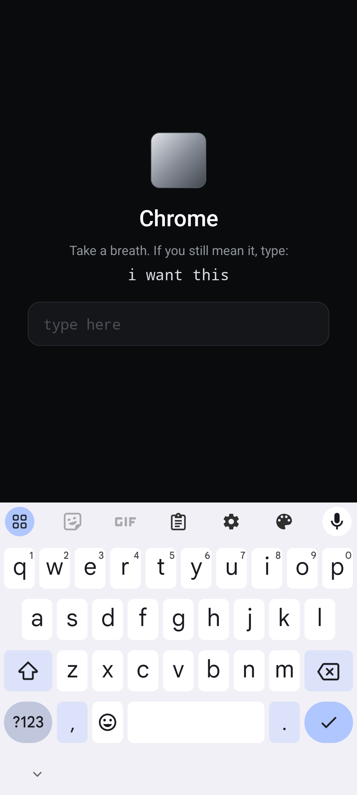
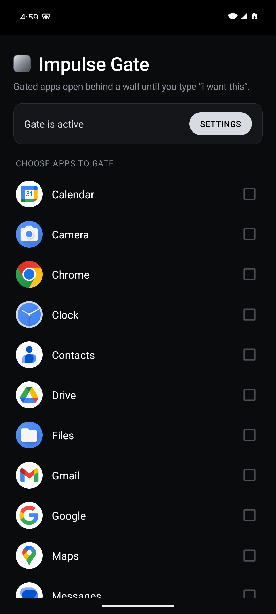

# Impulse Gate

**[⬇ Download the APK (v1.0)](https://github.com/lambdaf-org/impulse-gate/releases/latest)** (~620 KB, Android 8.0+)

Your phone is full of apps engineered by very smart people whose paycheck depends on
you opening them. They won that fight years ago: at some point "checking" stopped
being a decision and became a reflex. Willpower does nothing against a feed tuned by
ten thousand A/B tests. So stop fighting fair.

A tiny Android app (~600 KB, zero dependencies) that puts a wall between you and your
impulses. You pick which apps to gate; from then on, opening one of them shows a
fully opaque full-screen overlay **before you can see anything**, and the app stays
hidden until you type:

```
i want this
```

Eleven keystrokes. Long enough to wake up the part of your brain that actually decides
things. If you still mean it, fine: you typed it, go in with your eyes open. Most of
the time you won't bother, because you never wanted to open it in the first place. The
reflex did.

Leave the app and the gate re-arms, so the next open asks you to type again. Transient
windows like the keyboard or a permission dialog do **not** re-lock you mid-session.

<p align="center">
  
  
</p>

Verified end-to-end on an Android 15 emulator, from the opaque gate through phrase
unlock and re-lock on leave.

## How it works

One `AccessibilityService` listens for window changes. When a gated app reaches the
foreground it attaches an opaque, full-screen `TYPE_ACCESSIBILITY_OVERLAY` window with
no animation. The Back button is swallowed; Home is the escape hatch. No "draw over
other apps" permission is needed, since accessibility services may add these overlays
directly. The service reads nothing from your screen
(`canRetrieveWindowContent="false"`).

## Build

Requires JDK 17 and the Android SDK (platform 35).

```bash
export JAVA_HOME=/opt/homebrew/opt/openjdk@17/libexec/openjdk.jdk/Contents/Home
export ANDROID_HOME=$HOME/Library/Android/sdk
./gradlew assembleRelease
```

APK lands at `app/build/outputs/apk/release/app-release.apk` (debug-signed, sideloadable).

## Install & set up

1. Enable USB debugging on the phone, then:
   ```bash
   $ANDROID_HOME/platform-tools/adb install app/build/outputs/apk/release/app-release.apk
   ```
   (Or copy the APK over and open it on the phone.)
2. Open **Impulse Gate**, tick the apps you want gated.
3. Tap **ENABLE** → Accessibility settings → Impulse Gate → turn it on.

> **Android 13+ note:** if you installed the APK from a file manager or browser
> (not adb), Android blocks the accessibility toggle for sideloaded apps. Fix: go to
> *Settings → Apps → Impulse Gate → ⋮ (top right) → Allow restricted settings*, then
> enable the service. Installing via `adb install` avoids this entirely.

## Notes & known limits

- The overlay appears the moment the system reports the window change. That is
  practically instant, though a sub-100 ms flash of the app is inherent to the
  accessibility approach on some devices.
- Typing the phrase unlocks that app until you leave it. Each gated app is unlocked
  separately.
- Pasting the phrase doesn't count. The field blocks autofill and the paste menu, and
  a clipboard-sized text jump gets wiped. You have to type it by hand.
- The recents screen shows the gated app's real thumbnail (Android snapshots the app's
  own surfaces; an external overlay can't be part of it). Inherent to this approach.
- If Android force-kills the service (aggressive OEM battery management) while a gated
  app is open, the gate drops until the service auto-rebinds. On stock Android the
  system re-fires the window event on rebind and the gate self-restores in about a
  second. A hard guarantee would require the "read screen content" capability, which
  this app deliberately avoids.
- This is self-discipline software. You can always uninstall it or disable the
  service; the gate only needs to make opening an app a conscious act.
